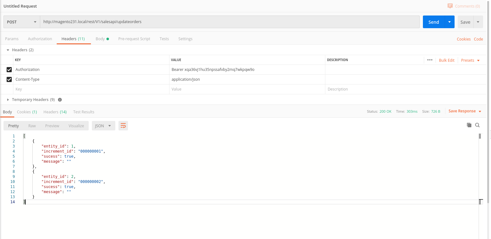
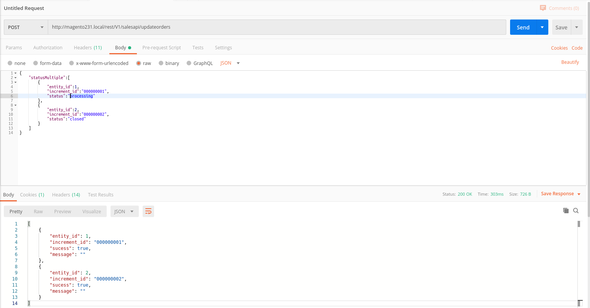

# Update Order Status Via API

## Installation
\* = in production please use the `--keep-generated` option

### Type 1: Zip file

 - Unzip the zip file in `app/code/South/UpdateOrderStatus`
 - Enable the module by running `php bin/magento module:enable South_UpdateOrderStatus`
 - Apply database updates by running `php bin/magento setup:upgrade`\*
 - Flush the cache by running `php bin/magento cache:flush`

## Screenshots

## Sample payload 

``
    {
        "statusMultiple":[
            {
                "entity_id":1,
                "increment_id":"000000001",
                "status":"processing"
            },
            {
                "entity_id":2,
                "increment_id":"000000002",
                "status":"closed"
            }
        ]
    }
``

